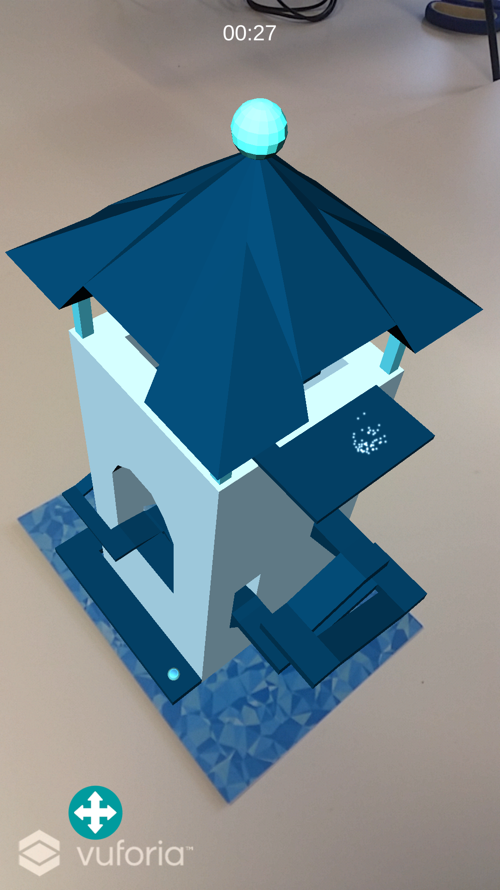
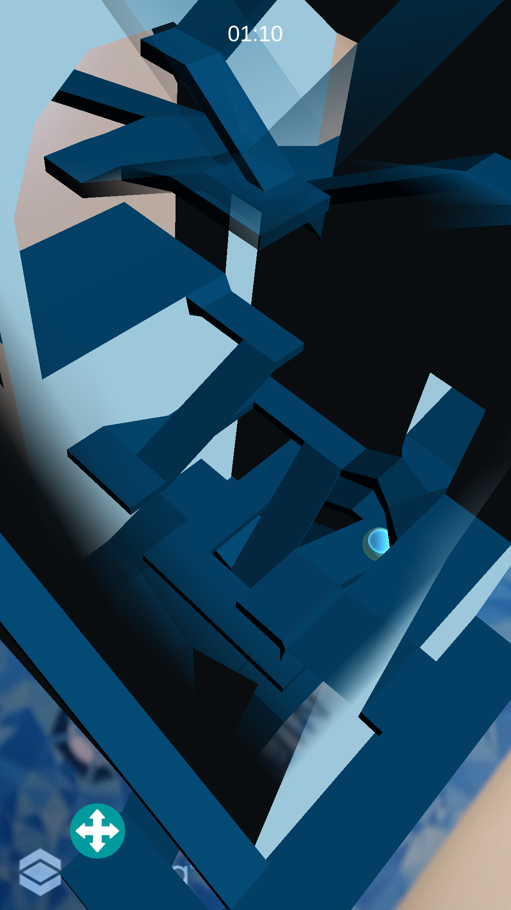
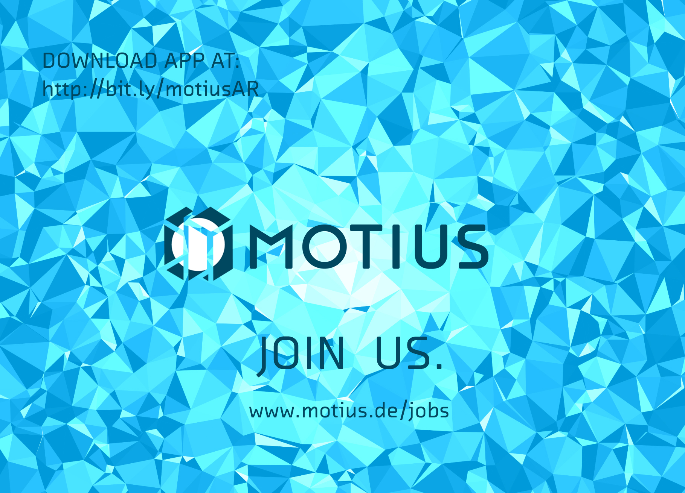

# Motius MazeAR

This small project was developed using Vuforia with Unity. The objective is to reach the top of the tower as fast as possible.

## Prerequisites

* Unity 2017.2.0f2
* MonoDevelop or Visual Studio 2017
* Android SDK
* Android Phone

## Getting Started

* Clone this repository and open the unity project
* Set build settings to Android
* Build with the phone connected via USB
* Profit!

## Screenshots
 

## Marker to print

## Authors

* **Mo Bahrouni** [Art/Design]
* [**Jean Paul Vieira Filho**](https://github.com/jeanfilho) [Programmer]
* **Sören Gunia** [Project Lead/Design]
* [**Tamas Neumer**](https://github.com/TamasNeumer) [Design]
